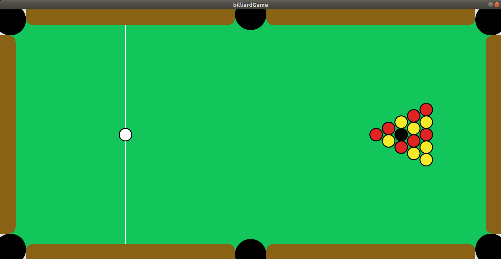

# SimpleSimulations

## billiardGame
This is a two-dimensional simulation of the billiard game. 

The balls used were produced from the `Particle` class from the `particlesInABox` project. A delicate collision system was developed to handle the interaction between balls and balls, balls and edges, balls and holes. Additionally, to avoid the balls crashing into each other and the edges, contact resolution method were developed to extradicate this.
 
## doublePendulum
This is my first simulation of the double pendulum. 

It features a pendulum swing side by side under gravity where the colour of the centre of the pendulum changes according to its speed.

## fireworkSystem
This project is still in development and will feature two-dimensional fireworks. The goal is to make it as artistic as possible. 

## particlesInABox
This simulation features particles bumping into each other. 

There is software implementation to either choose the particles to stay in a box - hit the sides of the container, or apply boundary conditions - when a particle exits a side it re-enters from the opposing side. Their colour is a representation of their speed. 'asdw' keys on the keyboard can be used to control their movement and a 'clock' is shown to indicate how much time has passed since the beginning of the smulation. Particles can be added upon clicking and the simulation has the additional features that it can be `reset`, using the `r` key, and `paused`, using the `p` key. This can be though as a small particle engine used in the development of the billiard Game but with a more simplistic collision resolution.

## platformGame
This project is in development phase and is built upon an older version of the 'particlesInABox' Particle class. The goal is to develop it into a simplified 2D platform game, like `Super Mario`.

## sandAndWaterSimulation
This is a sand and water simulation. It is based on 2D cellular automata with simple rules to simulate pixel building of sand and water respectively. The pilling algorithms were developed by myself using nothing but intuition and a developing 'bottom-up' approach. The algorithms can further be developed to produce, for example by producing fire, and make water-sand interactions more realistic. 
